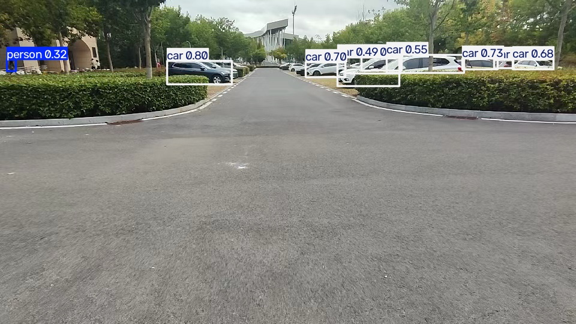

# 真实视频今晚验证：模型对照与风险链路

**日期**：2026-09-20  
**输入**：`data/raw/` 中 13 段用户视频，共约 3,210 帧  
**目的**：验证同一批真实视频上的推理、ByteTrack 和风险引擎是否能完整运行，并比较公开数据微调模型与 COCO 通用基线。

## 结果摘要

| 模型 | 置信度 | 成功处理 | 有轨迹视频 | 轨迹数合计 | 风险告警合计 |
|---|---:|---:|---:|---:|---:|
| ScooterDet 微调 YOLOv8n 320 | 0.10 | 13/13 | 5/13 | 15 | 0 |
| COCO YOLOv8n | 0.25 | 13/13 | 13/13 | 584 | 81 |

COCO 基线的 81 次告警包括 78 次“警告”和 3 次“危险”；这些告警不能直接当作真实事件召回，因为当前本地视频的 `near_miss` / `conflict` 事件尚未完成独立人工标注。它们只能证明端到端链路能在真实视频上产出可审计结果。

## 开放词汇候选扫描

为缓解四类微调模型对本地电动车的漏检，额外使用 YOLO-World 对 658 张本地帧进行开放词汇扫描，提示词包括 `electric bicycle`、`electric scooter`、`bicycle`、`motorcycle` 和 `person` 等。结果为 6 个电动车/电动滑板车候选框，分布在 5 张图片、3 段视频；候选图见 `open_vocab_two_wheeler_candidates.jpg`。

这些框目前标记为 `candidate_review`，不是训练真值。它们可以帮助标注人优先检查目标接近、正面骑行和遮挡帧，但必须人工确认后才能进入本地训练集。脚本会把输入分成小块，避免 MPS 把全部图片作为一个批次而申请过大的缓冲区。

在其中一段 248 帧本地视频上，开放词汇模型经过 ByteTrack 后输出 11 个轨迹，其中 2 个轨迹被归一为 `electric_bicycle`；当前该片段没有触发风险告警。报告保存在 `open_vocab_video_risk.json`。这证明候选类别已经可以接入现有风险引擎，但不代表告警正确率，仍需人工事件标注。

## 这次验证证明了什么

1. 训练权重可以被加载并逐帧运行。
2. 两种模型都能经过检测 → ByteTrack → 风险引擎 → JSON 报告的完整链路。
3. 公开数据微调模型在本地胸挂视角上明显漏检，不能拿来做安全告警。
4. COCO 基线的目标覆盖更高，但类别是 `person`、`bicycle`、`motorcycle`、`car` 等通用类别，不等价于“已经识别电动车”。
5. 下一步最有价值的工作是标注本地视频，而不是继续盲目增加公开数据训练轮数。

## 现场展示建议

展示 `coco_baseline_local_frame.jpg` 时，口径应为：

> 这是本地胸挂视频上的通用目标检测可视化，证明输入、检测和可视化链路已经跑通；它不是电动车专类模型的准确率证明。专类模型当前仍受本地标注不足限制。



## 复现命令

```bash
python scripts/batch_detect_videos.py \
  --raw-dir data/raw \
  --output-dir /tmp/blindnav-tonight/evidence_scooterdet \
  --model models/scooterdet_yolov8n_320_v1.pt \
  --device mps --conf 0.10 --looming-threshold 0.06

python scripts/batch_detect_videos.py \
  --raw-dir data/raw \
  --output-dir /tmp/blindnav-tonight/evidence_coco \
  --model models/yolov8n.pt \
  --device mps --conf 0.25 --looming-threshold 0.06
```

详细的独立测试集指标仍以根目录 `BASELINE_REPORT.md` 为准；本报告不把未标注视频上的告警包装成准确率或召回率。
